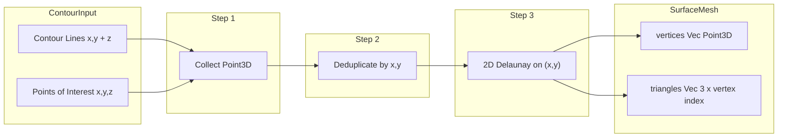

# Contour to 3D Surface Mesh

## Context

`[ContourInput](crates/takeoff_core/src/contour.rs)` contains:

- **lines**: Contour lines at discrete elevations, each with `Vec<Point>` (x,y) and a single `elevation` (z)
- **points_of_interest**: Sparse (x, y, z) points

The existing `ContourMesh` only collects a flat list of `Point3D` — it has no triangle connectivity. For volumetric cut/fill calculations, we need a proper triangulated surface (vertices + faces).

## Approach: TIN (Triangulated Irregular Network)

Use 2D Delaunay triangulation on the (x, y) plane, with z preserved from the source data. This is the standard GIS approach for terrain surfaces.




## Implementation Plan

### 1. Add dependency

Add **delaunator** to `[crates/takeoff_core/Cargo.toml](crates/takeoff_core/Cargo.toml)`:

- Lightweight, fast, well-maintained
- Simple API: `triangulate(&[Point {x, y}])` returns `Triangulation { triangles: Vec<usize> }` (3 indices per triangle)

### 2. Define `SurfaceMesh` struct

In `[contour.rs](crates/takeoff_core/src/contour.rs)` (or a new `surface.rs` module), add:

```rust
pub struct SurfaceMesh {
  pub vertices: Vec<Point3D>,
  pub triangles: Vec<[u32; 3]>,  // vertex indices
}
```

- `vertices`: Unique (x, y, z) points after deduplication
- `triangles`: Each `[i, j, k]` references `vertices[i]`, `vertices[j]`, `vertices[k]`

### 3. Deduplicate (x, y) points

Contour lines can share (x, y) at junctions; points may be near-duplicates. Before triangulation:

- Deduplicate by (x, y) using a tolerance (e.g. 1e-9) or exact match
- When merging duplicates: keep first z, or optionally average z (configurable)
- Use a stable order so indices are deterministic

### 4. Triangulation logic

1. Collect all `Point3D` from lines and points_of_interest (reuse existing `ContourMesh::from` logic)
2. Deduplicate to get unique `vertices` and a mapping from original index → vertex index if needed
3. Build `Vec<delaunator::Point>` from `vertices` (x, y only)
4. Call `delaunator::triangulate(&points)`
5. Convert `result.triangles` (flat `[i,j,k, i,j,k, ...]`) into `Vec<[u32; 3]>`
6. Handle degenerate case: delaunator returns empty triangles when points are collinear

### 5. Conversion API

Add `impl TryFrom<ContourInput> for SurfaceMesh` (or `From` with a `Result`) since triangulation can fail with too few or collinear points.

Optionally extend `ContourInput` with a helper:

```rust
impl ContourInput {
  pub fn to_surface_mesh(&self) -> Result<SurfaceMesh, SurfaceMeshError>
}
```

### 6. NAPI / TypeScript bindings (optional for v1)

If the surface mesh will be consumed from JS/TS, add `#[napi(object)]` to a DTO and expose the conversion. If only Rust consumers for now, keep it internal.

### 7. Edge cases to handle

- **&lt; 3 points**: Return error or empty mesh
- **Collinear points**: Delaunator returns empty triangles; return error with a clear message
- **Duplicate (x,y)**: Deduplicate; document z-resolution strategy (first vs average)

## File changes summary


| File                                                 | Change                                                           |
| ---------------------------------------------------- | ---------------------------------------------------------------- |
| `crates/takeoff_core/Cargo.toml`                     | Add `delaunator` dependency                                      |
| `crates/takeoff_core/src/contour.rs` or `surface.rs` | Add `SurfaceMesh`, dedup, triangulation, `TryFrom<ContourInput>` |
| `crates/takeoff_core/src/lib.rs`                     | Export new types if in separate module                           |


## Future: Volumetric calculations

Once `SurfaceMesh` exists, cut/fill can be computed by:

- Defining a reference plane (e.g. foundation at z = 5729)
- For each triangle: compute signed volume between triangle and plane (prism)
- Sum volumes above (cut) and below (fill) the plane

That can be a follow-up task.